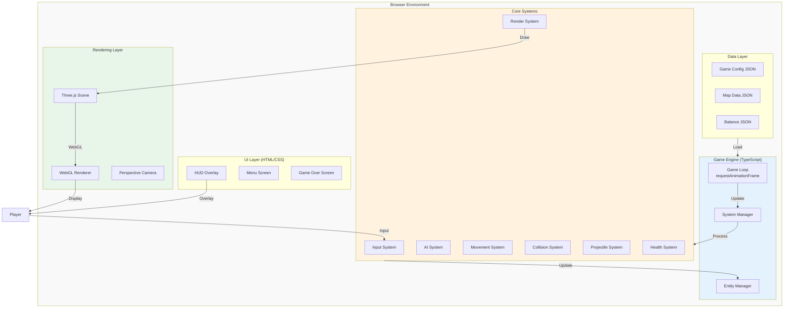
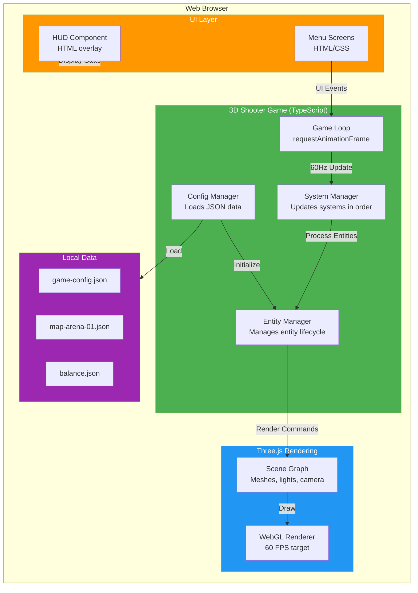
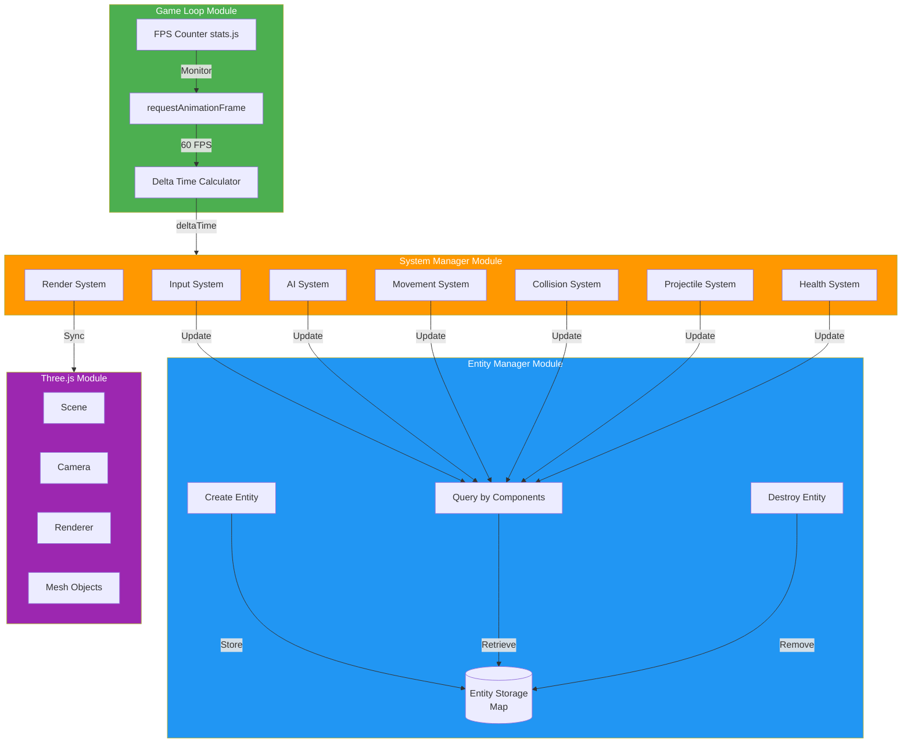
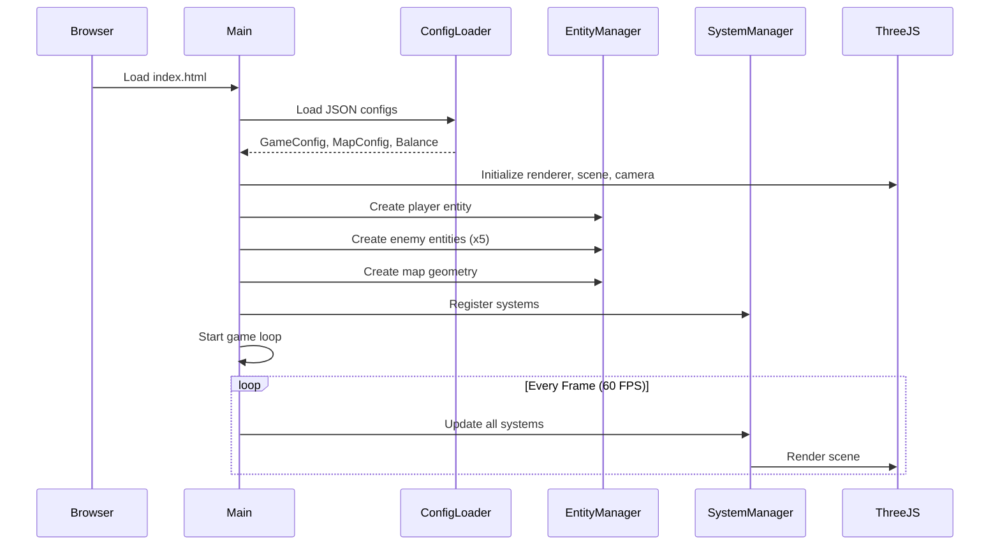
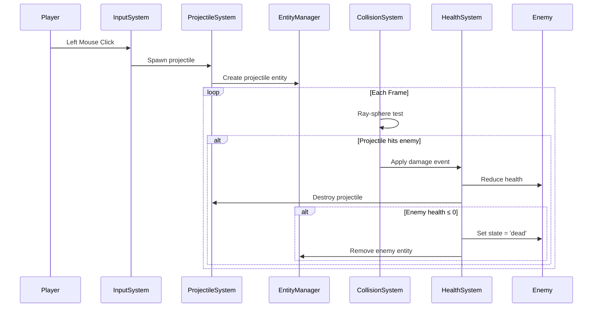
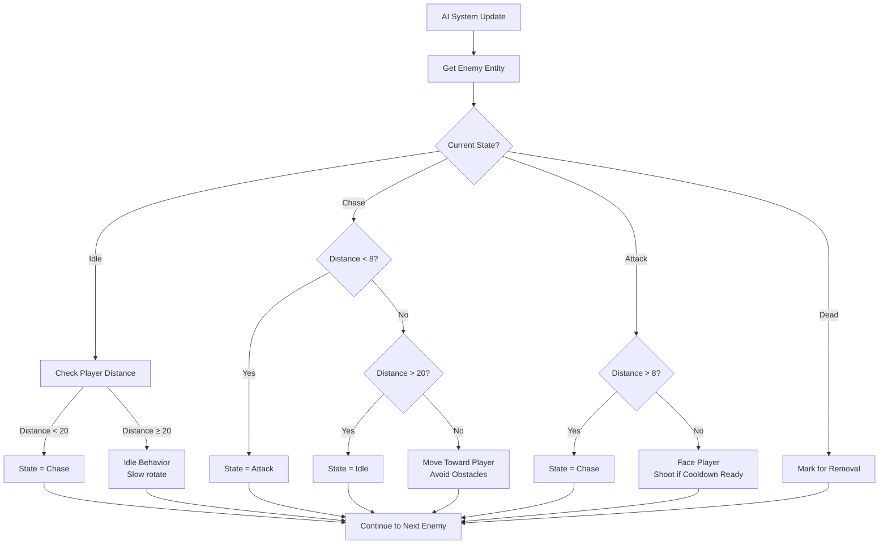
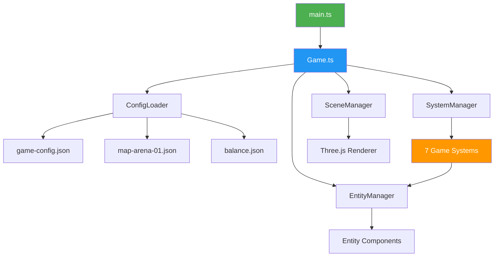

# System Design: 3D WebGL Shooter Game

**Version**: 1.0
**Last Updated**: 2025-11-09
**Status**: Active
**Related Spec**: [SPEC-0001: 3D Shooter Game](../specs/spec-0001-3d-shooter-game.md)

---

## Table of Contents

1. [Executive Summary](#executive-summary)
2. [System Overview](#system-overview)
3. [Architecture Pattern](#architecture-pattern)
4. [Core Systems](#core-systems)
5. [Component Architecture](#component-architecture)
6. [Data Flow](#data-flow)
7. [Technology Stack](#technology-stack)
8. [Deployment Architecture](#deployment-architecture)
9. [Performance Architecture](#performance-architecture)
10. [Integration Points](#integration-points)
11. [Security Architecture](#security-architecture)
12. [Monitoring and Observability](#monitoring-and-observability)

---

## Executive Summary

This document describes the technical architecture for a browser-based 3D first-person shooter game built with Three.js and TypeScript. The system employs an Entity Component System (ECS) architecture pattern, uses simple collision detection algorithms (AABB and ray-sphere), and implements a finite state machine for enemy AI.

**Key Architectural Decisions**:
- **Rendering**: Three.js with WebGL backend ([ADR-0001](./adr/0001-threejs-rendering-approach.md))
- **Collision**: Hybrid AABB + ray-sphere approach ([ADR-0002](./adr/0002-collision-detection-strategy.md))
- **Entity Management**: Lightweight ECS pattern ([ADR-0003](./adr/0003-entity-component-system.md))
- **AI**: Finite State Machine with 4 states ([ADR-0004](./adr/0004-ai-state-machine.md))
- **Configuration**: JSON-based data-driven design ([ADR-0005](./adr/0005-asset-loading-strategy.md))

**Performance Targets**:
- 60 FPS sustained with 5 enemies, 10 projectiles
- Initial load time < 3 seconds
- Bundle size < 500 KB gzipped

---

## System Overview

### High-Level Architecture



### System Context (C4 Level 1)


**External Dependencies**: None (fully client-side, no API calls)

---

## Architecture Pattern

### Entity Component System (ECS)

See [ADR-0003: Entity Component System](./adr/0003-entity-component-system.md) for detailed rationale.

**Pattern Overview**:
- **Entity**: Unique ID + component container (data bag)
- **Component**: Pure data structure (position, health, velocity)
- **System**: Logic that operates on entities with specific components

**Why ECS?**
- Modularity: New behaviors = new systems, no hierarchy changes
- Testability: Systems can be unit tested in isolation
- Performance: Cache-friendly iteration over component arrays
- Flexibility: Entity behavior defined by composition, not inheritance

### Container Diagram (C4 Level 2)



---

## Core Systems

### System Execution Order

Systems execute in a specific order each frame to ensure correct game logic:

```
1. InputSystem       → Process keyboard/mouse, update player input component
2. AISystem          → Update enemy state machines, set target velocities
3. MovementSystem    → Apply velocities to positions
4. CollisionSystem   → Detect and resolve collisions (AABB, ray-sphere)
5. ProjectileSystem  → Update lifetimes, check hits, spawn/despawn
6. HealthSystem      → Apply damage, check death conditions
7. RenderSystem      → Sync Three.js meshes with entity positions
```

**Why this order?**
- Input processed first (immediate response to player)
- AI before movement (calculate desired velocity)
- Collision after movement (resolve penetrations)
- Health after collision (damage from projectile hits)
- Render last (display final positions)

### System Descriptions

#### 1. Input System
**Responsibility**: Translate keyboard/mouse events into player velocity

**Components Used**: `InputComponent`, `VelocityComponent`

**Behavior**:
- Listen to `keydown`/`keyup` events (WASD, Arrow keys)
- Track mouse delta via Pointer Lock API
- Update player velocity vector based on pressed keys
- Update player rotation based on mouse movement

**Performance**: <0.1ms per frame (event-driven, minimal computation)

#### 2. AI System
**Responsibility**: Update enemy behavior state machines

**Components Used**: `AIComponent`, `PositionComponent`, `VelocityComponent`, `ShooterComponent`

**Behavior**:
- For each enemy, execute current state logic (idle, chase, attack, dead)
- Check state transition conditions (distance to player)
- Update target velocity (chase direction)
- Trigger shooting when in attack state
- Perform obstacle avoidance raycasts

**Performance**: <0.5ms per frame (5 enemies * ~0.1ms each)

**State Machine**: See [ADR-0004: AI State Machine](./adr/0004-ai-state-machine.md)

#### 3. Movement System
**Responsibility**: Apply velocities to entity positions

**Components Used**: `PositionComponent`, `VelocityComponent`

**Behavior**:
```typescript
position += velocity * deltaTime
```

**Performance**: <0.1ms per frame (simple vector math for 20 entities)

#### 4. Collision System
**Responsibility**: Detect and resolve collisions

**Components Used**: `PositionComponent`, `VelocityComponent`, `ColliderComponent`

**Behavior**:
- AABB collision for entities vs walls/obstacles
- Ray-sphere collision for projectiles vs entities
- Resolve by moving entity back to valid position
- Set velocity to zero in collision direction

**Performance**: <0.5ms per frame (54 AABB checks + 60 ray-sphere checks)

**Algorithm Details**: See [ADR-0002: Collision Detection](./adr/0002-collision-detection-strategy.md)

#### 5. Projectile System
**Responsibility**: Manage projectile lifecycle and hits

**Components Used**: `ProjectileComponent`, `PositionComponent`, `VelocityComponent`

**Behavior**:
- Update projectile lifetime counters
- Check for hits (via CollisionSystem results)
- Apply damage on hit
- Destroy projectiles on hit or timeout
- Object pooling: reuse destroyed projectiles

**Performance**: <0.2ms per frame (10 active projectiles)

#### 6. Health System
**Responsibility**: Apply damage and handle death

**Components Used**: `HealthComponent`

**Behavior**:
- Listen for damage events (from collision/projectile systems)
- Reduce health by damage amount
- Trigger death when health ≤ 0
- Remove dead entities from scene
- Update HUD health display

**Performance**: <0.1ms per frame (only processes damaged entities)

#### 7. Render System
**Responsibility**: Sync Three.js scene with entity state

**Components Used**: `PositionComponent`, `MeshComponent`

**Behavior**:
```typescript
mesh.position.copy(entity.position)
mesh.rotation.copy(entity.rotation)
```

**Performance**: <0.3ms per frame (20 entities * transform update)

---

## Component Architecture

### Component Diagram (C4 Level 3 - Game Loop)



### Component Types

#### Position Component
```typescript
interface PositionComponent {
  type: 'position';
  position: THREE.Vector3;
  rotation: THREE.Euler;
}
```

#### Velocity Component
```typescript
interface VelocityComponent {
  type: 'velocity';
  velocity: THREE.Vector3;
  speed: number; // Max speed multiplier
}
```

#### Health Component
```typescript
interface HealthComponent {
  type: 'health';
  current: number;
  max: number;
}
```

#### Mesh Component
```typescript
interface MeshComponent {
  type: 'mesh';
  mesh: THREE.Mesh; // Reference to Three.js object
}
```

#### AI Component
```typescript
interface AIComponent {
  type: 'ai';
  state: 'idle' | 'chase' | 'attack' | 'dead';
  detectionRadius: number;
  attackRange: number;
  target: Entity | null;
  accuracy: number;
}
```

#### Shooter Component
```typescript
interface ShooterComponent {
  type: 'shooter';
  damage: number;
  cooldown: number; // Seconds between shots
  lastShotTime: number;
}
```

#### Projectile Component
```typescript
interface ProjectileComponent {
  type: 'projectile';
  owner: 'player' | 'enemy';
  lifetime: number; // Max lifetime in seconds
  age: number; // Current age
}
```

#### Collider Component
```typescript
interface ColliderComponent {
  type: 'collider';
  shape: 'aabb' | 'sphere';
  radius?: number; // For sphere
  size?: THREE.Vector3; // For AABB
}
```

---

## Data Flow

### Game Initialization Flow



### Projectile Hit Flow



### Enemy AI Decision Flow



---

## Technology Stack

### Core Technologies

| Layer | Technology | Version | Purpose |
|-------|-----------|---------|---------|
| **Language** | TypeScript | 5.0+ | Type-safe development |
| **3D Engine** | Three.js | r150+ | WebGL rendering, scene graph |
| **Build Tool** | Vite | 4.0+ | Dev server, HMR, bundling |
| **Bundler** | Rollup | (via Vite) | Production optimization |
| **Testing** | Vitest | Latest | Unit tests (80% coverage target) |
| **E2E Testing** | Playwright | Latest | Browser automation tests |
| **Linting** | ESLint | Latest | Code quality, TypeScript rules |

### Browser APIs Used

- **WebGL 2.0**: 3D rendering via Three.js
- **Pointer Lock API**: First-person mouse control
- **requestAnimationFrame**: 60 FPS game loop
- **Performance API**: FPS monitoring, profiling
- **Fetch API**: Load JSON configuration files

### Development Dependencies

```json
{
  "dependencies": {
    "three": "^0.150.0"
  },
  "devDependencies": {
    "@types/three": "^0.150.0",
    "typescript": "^5.0.0",
    "vite": "^4.0.0",
    "vitest": "^0.34.0",
    "eslint": "^8.0.0",
    "@typescript-eslint/eslint-plugin": "^6.0.0",
    "playwright": "^1.40.0"
  }
}
```

### File Structure

```
sw-mini-doom/
├── src/
│   ├── main.ts                 # Entry point, initialization
│   ├── game/
│   │   ├── Game.ts             # Main game class
│   │   ├── GameLoop.ts         # requestAnimationFrame loop
│   │   └── GameState.ts        # State machine (menu, playing, gameover)
│   ├── ecs/
│   │   ├── Entity.ts           # Entity interface
│   │   ├── Component.ts        # Component base types
│   │   ├── EntityManager.ts    # Entity lifecycle management
│   │   └── SystemManager.ts    # System update pipeline
│   ├── systems/
│   │   ├── InputSystem.ts
│   │   ├── AISystem.ts
│   │   ├── MovementSystem.ts
│   │   ├── CollisionSystem.ts
│   │   ├── ProjectileSystem.ts
│   │   ├── HealthSystem.ts
│   │   └── RenderSystem.ts
│   ├── components/
│   │   ├── PositionComponent.ts
│   │   ├── VelocityComponent.ts
│   │   ├── HealthComponent.ts
│   │   ├── AIComponent.ts
│   │   └── [other components]
│   ├── rendering/
│   │   ├── SceneManager.ts     # Three.js scene setup
│   │   ├── MeshFactory.ts      # Geometry creation
│   │   └── MaterialLibrary.ts  # Reusable materials
│   ├── collision/
│   │   ├── AABB.ts             # Axis-aligned bounding box
│   │   ├── RaySphere.ts        # Ray-sphere intersection
│   │   └── CollisionResolver.ts
│   ├── ai/
│   │   ├── StateMachine.ts     # FSM base class
│   │   └── EnemyAI.ts          # Enemy state implementations
│   ├── data/
│   │   ├── game-config.json
│   │   ├── map-arena-01.json
│   │   └── balance.json
│   ├── loaders/
│   │   ├── ConfigLoader.ts
│   │   └── types.ts            # Config TypeScript interfaces
│   └── ui/
│       ├── HUD.ts              # Health, kills, timer
│       └── MenuScreen.ts       # Start, game over screens
├── tests/
│   ├── unit/
│   │   ├── collision.test.ts
│   │   ├── ai.test.ts
│   │   └── entity-manager.test.ts
│   └── e2e/
│       └── gameplay.spec.ts
├── public/
│   └── index.html
├── package.json
├── tsconfig.json
├── vite.config.ts
└── README.md
```

---

## Deployment Architecture

### Build Pipeline


### Hosting Options

**Primary: GitHub Pages** (Free, Recommended)
- Static file hosting
- HTTPS by default
- CDN distribution
- Zero cost
- Git-based deployment workflow

**Alternative: Netlify/Vercel** (Free Tier)
- More deployment features
- Preview deployments for PRs
- Better analytics
- Custom domain support

**Not Recommended**: Traditional hosting (unnecessary complexity/cost)

### Build Configuration

**Production Build** (`vite build`):
- Minification: Terser
- Tree-shaking: Dead code elimination
- Code splitting: Vendor bundle separation
- Asset optimization: Image compression, font subsetting
- Source maps: Separate file (not inlined)

**Target Bundle Sizes**:
- `main.js`: ~250KB gzipped (game logic + Three.js)
- `vendor.js`: ~150KB gzipped (Three.js core only)
- `styles.css`: <10KB gzipped
- `data/*.json`: <5KB total

**Total**: < 500KB gzipped ✅

---

## Performance Architecture

### Performance Budget

| Metric | Target | Maximum | Validation |
|--------|--------|---------|------------|
| **FPS** | 60 | 55 | Chrome DevTools Performance |
| **Frame Time** | 16.67ms | 18ms | stats.js overlay |
| **Initial Load** | <2s | 3s | Lighthouse audit |
| **Bundle Size** | <400KB | 500KB | `npm run build` output |
| **Entities** | 20 | 30 | Stress test |
| **Draw Calls** | <50 | 100 | Three.js stats |

### Frame Budget Breakdown

Total budget: **16.67ms per frame** (60 FPS)

| System | Budget | Typical | Notes |
|--------|--------|---------|-------|
| Input System | 0.1ms | 0.05ms | Event-driven |
| AI System | 1.0ms | 0.5ms | 5 enemies * 0.1ms |
| Movement System | 0.2ms | 0.1ms | Vector math |
| Collision System | 1.5ms | 0.7ms | 54 AABB + 60 ray-sphere |
| Projectile System | 0.5ms | 0.2ms | 10 projectiles |
| Health System | 0.2ms | 0.1ms | Event-driven |
| Render System | 0.5ms | 0.3ms | Transform updates |
| Three.js Render | 10ms | 5-8ms | GPU rendering |
| **TOTAL** | **14ms** | **7-10ms** | **Headroom: 3-7ms** |

### Optimization Techniques

**Implemented**:
1. **Object Pooling**: Projectiles reused instead of create/destroy
2. **Frustum Culling**: Three.js automatic (off-screen objects not drawn)
3. **Simple Geometry**: <10,000 triangles total in scene
4. **Instanced Materials**: Enemies share same material (reduced draw calls)
5. **Delta Time**: Physics framerate-independent

**Deferred** (implement if FPS drops):
1. **Spatial Partitioning**: Grid-based collision culling
2. **Level of Detail (LOD)**: Lower poly models at distance
3. **Occlusion Culling**: Don't render objects behind walls
4. **Web Workers**: Offload AI computation to separate thread

### Profiling Strategy

**Tools**:
- **stats.js**: Real-time FPS monitor (top-left corner in dev)
- **Chrome DevTools Performance**: Frame-by-frame analysis
- **Three.js Stats**: Draw calls, triangles, memory usage

**Profiling Workflow**:
1. Run game with stats.js overlay
2. Play for 60 seconds, observe min/max/avg FPS
3. If FPS < 60, open Chrome Performance profiler
4. Record 3 seconds of gameplay
5. Identify bottleneck functions (flame graph)
6. Optimize hottest code path first
7. Repeat until 60 FPS achieved

---

## Integration Points

### No External Integrations

This game has **zero external dependencies** at runtime:
- No API calls
- No analytics (can add privacy-friendly Plausible later)
- No CDN assets (all bundled)
- No third-party scripts

**Why?**
- Specification requirement (NFR-006: No external network requests)
- Privacy-friendly (no user tracking)
- Works offline (after initial load)
- No runtime failures from network issues

### Internal Module Integration



---

## Security Architecture

### Threat Model

**Attack Surface**: Minimal (client-side only)

**Potential Threats**:
1. **XSS (Cross-Site Scripting)**: N/A - no user input stored or rendered
2. **CSRF (Cross-Site Request Forgery)**: N/A - no server-side state
3. **Malicious JSON**: Local files only, no user-uploaded configs
4. **Cheating**: Possible (client-side game state) but low impact (single-player)

**Mitigations**:
- No `eval()` or `innerHTML` usage
- TypeScript strict mode (type safety)
- ESLint security rules enabled
- No external script inclusion
- Content Security Policy (CSP) headers on GitHub Pages

### Content Security Policy

Recommended CSP header (configure in hosting platform):
```
Content-Security-Policy:
  default-src 'self';
  script-src 'self';
  style-src 'self' 'unsafe-inline';
  img-src 'self' data:;
  connect-src 'self';
```

**Why `'unsafe-inline'` for styles?**
- Vite injects CSS during development
- Production CSS is in separate file (no inline needed)

---

## Monitoring and Observability

### Development Monitoring

**Built-in Tools**:
- `stats.js`: FPS, frame time, memory usage (top-left overlay)
- Browser console: Error logs, warnings
- Chrome DevTools Performance: Profiling

**Custom Metrics** (logged to console):
```typescript
{
  fps: 60,
  frameTime: 16.5,
  entities: 20,
  projectiles: 10,
  drawCalls: 45,
  triangles: 8234,
  memory: {
    geometries: 15,
    textures: 3,
    programs: 2
  }
}
```

### Production Monitoring (Optional, P2/P3)

**Privacy-Friendly Analytics**:
- **Plausible** or **Fathom**: No cookies, GDPR-compliant
- Metrics: Page views, session duration, browser distribution

**Error Tracking**:
- **Sentry** (open-source): Catch runtime errors, stack traces
- Only if error rate > 1%

**Not Implemented in MVP**:
- User tracking (not needed, privacy violation)
- A/B testing (no server-side control)
- Heatmaps (no user identification required)

---

## Appendix

### Related Architecture Decisions

- [ADR-0001: Three.js Rendering Approach](./adr/0001-threejs-rendering-approach.md)
- [ADR-0002: Collision Detection Strategy](./adr/0002-collision-detection-strategy.md)
- [ADR-0003: Entity Component System Architecture](./adr/0003-entity-component-system.md)
- [ADR-0004: AI State Machine Design](./adr/0004-ai-state-machine.md)
- [ADR-0005: Asset Loading Strategy](./adr/0005-asset-loading-strategy.md)

### References

- Three.js Documentation: https://threejs.org/docs/
- Game Programming Patterns: http://gameprogrammingpatterns.com/
- TypeScript Handbook: https://www.typescriptlang.org/docs/
- MDN WebGL Guide: https://developer.mozilla.org/en-US/docs/Web/API/WebGL_API
- C4 Model: https://c4model.com/

### Glossary

- **AABB**: Axis-Aligned Bounding Box - collision shape aligned with world axes
- **ECS**: Entity Component System - architecture pattern separating data and logic
- **FPS**: Frames Per Second - rendering performance metric (target: 60)
- **FSM**: Finite State Machine - AI pattern with discrete states and transitions
- **HUD**: Heads-Up Display - on-screen UI showing player stats
- **Raycasting**: Technique to detect intersections along a ray
- **Three.js**: JavaScript 3D library abstracting WebGL
- **WebGL**: Web Graphics Library - JavaScript API for 3D rendering

---

**Document Approval**:
- System Architect: _____________ Date: _______
- Tech Lead: _____________ Date: _______

**Change Log**:
- v1.0 (2025-11-09): Initial system design created
